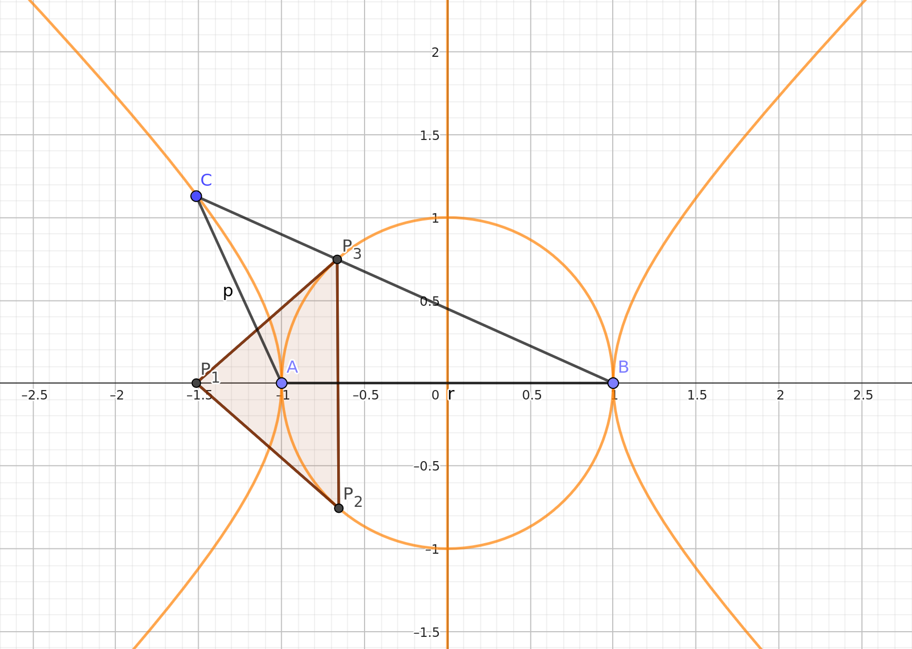

```@meta
CurrentModule = ParametricGroebnerBases
```

This page gives you two non-trivial examples, fully worked through, to demo the functionality of this package.

# Example 1 -- Lotka-Volterra equations
The Lotka-Volterra equations are a simple example of a first order ODE with a periodic solution. The equations are as follows:

$ \frac{dx}{dt} = \alpha x - \beta x y $

$ \frac{dy}{dt} = -\gamma y + \delta x y $

for some parameters $\alpha, \beta, \gamma$ and $\delta$. Even though the ODE has a periodic solution, there is also a steady state. If $x$ and $y$ hits a certain value determined by the parameters, the system will remain at those values. We are interested in finding such a stady state. We note, that a steady state is reached when $0 = \frac{dx}{dt} = \alpha x - \beta x y$ and $0 = \frac{dy}{dt} = -\gamma y + \delta x y$.

First, load Nemo for multivariate polynomials, and describe the ideal generated by the Lotka-Volterra equations:

```julia
julia> using Nemo
julia> using ParametricGroebnerBases

julia> R, (α, β, γ, δ) = QQ[:α, :β, :γ, :δ]
julia> S, (x, y) = R[:x, :y]

julia> I = [α*x - β*x*y, -γ*y + δ*x*y]
```

Now, we compute a parametric Gröbner system of this ideal.

```julia
julia> GS = CGS(I)
11-element Vector{Tuple{Vector{AbstractAlgebra.Generic.MPoly{QQMPolyRingElem}}, Vector{AbstractAlgebra.Generic.MPoly{QQMPolyRingElem}}, Vector{AbstractAlgebra.Generic.MPoly{QQMPolyRingElem}}}}:
 ([], [α*β*γ*δ], [β*γ*y^2 - α*γ*y, α*δ*x - β*γ*y])
 ([β*γ], [α*γ*δ], [α*γ*y, α*δ*x])
 ([β*γ, α*γ], [α*δ], [α*δ*x])
 ([β*γ, α*δ, α*γ], [δ], [δ*x*y - γ*y])
 ([δ, β*γ, α*γ], [γ], [γ*y])
 ([δ, γ], [β], [β*x*y - α*x])
 ([δ, γ, β], [α], [α*x])
 ([δ, γ, β, α], [1], [])
 ([β*γ, α*δ], [α*γ], [α*γ*y, α*γ*x])
 ([α*δ], [α*β*γ], [β*γ*y, α*γ*x])
 ([α*δ, α*γ], [β*γ], [β*γ*y])
```

Each line of the output is a triple. Consider the second line
```julia
 ([β*γ], [α*γ*δ], [α*γ*y, α*δ*x])
```

This states, that for any choice of parameters where $\beta \gamma = 0$ and $\alpha \gamma \delta \neq 0$, the reduced Gröbner basis of the ideal is $\{\alpha \gamma y, \alpha \delta x\}$. We, however, are interested in the first line, the socalled _generic_ case. It states, that whenever $\alpha \beta \gamma \delta \neq 0$ (i.e. when none of them are zero), the reduced Gröbner basis of the ideal is given by

$G = \{ \beta \gamma y^2 - \alpha \gamma y, \alpha \delta x - \beta \gamma y\}.$

Hence, we have a steady state whenever $ \beta \gamma y^2 - \alpha \gamma y = 0$ and $\alpha \delta x - \beta \gamma y = 0$. Notice, that the first polynomial is only in a single variable. Hence, we can solve this system by first solving for $y$, then substituting that into the second equation, and then solving for $x$. This a nice property of Gröbner bases. Whenever a system only has finitely many solutions, they can always be found in this way.

To solve the system, first note that $\beta \gamma y^2 - \alpha \gamma y = \gamma y(\beta y - \alpha)$. This has two solutions, namely $y = 0$ and $y = \frac{\alpha}{\beta}$. 

Substituting $y = 0$ into $\alpha \delta x - \beta \gamma y = 0$ gives $\alpha \delta x = 0$, yielding the solution $\{x = 0, y = 0\}$. If we substitute $y = \frac{\alpha}{\beta}$ into $\alpha \delta x - \beta \gamma y = 0$, we get

$\alpha \delta x - \alpha \gamma = 0$

which has the solution (assuming $\alpha \neq 0$) $x = \frac{\gamma}{\delta}$. Et voila, these are the steady states of the Lotka-Volterra equations. Obviously, solving the Lotka-Volterra equations directly is not difficult, but Gröbner basis methods scale well to more complicated polynomial systems.


# Example 2 -- Orthic triangles
 This example is this is taken from the article _Gröbner bases for polynomial systems with parameters_ by Antonio Montes and Michael Wibmer.

Let $A = (-1, 0)$, $B = (1, 0)$ and $C = (a, b)$ be three points in the plane. They form the vertices of a triangle called $ABC$. Now, draw the heights of the triangle and find the points where they intersect the edges of the triangle. Call these points $P_1, P_2$ and $P_3$. This triangle $P_1 P_2 P_3$ is called the orthic triangle of $ABC$. See the figure.


We wish to answer when the orthic triangle is isosceles with $|P_1 P_2| = |P_1 P_3|$. To do this, we first produce an ideal, which describes the setup. First, we notice that the point $P_1 = (a, 0)$. Next, to encode that the line $AC$ is orthoginal to the line $B P_2$, we need that their dotproduct is zero. Since the vector pointing from $A$ to $C$ is given by $(-1, 0) - (a, b) = (a + 1, -b)$ and the line from $B$ to $P_2$ is given by $(1, 0) - (x_2, y_2) = (x_2 - 1, -y_2)$, their dotproduct is $(a + 1)(x2 - 1) + b y_2$. Similarly, the dotproduct of $BC$ and $A P_3$ is given by $(a - 1)(x_3 + 1) + b y_3$.

This only defines the lines that $P_2$ and $P_3$ lies on. To fix their absolute position, we encode that $P_2$ lines on the same line as $AC$. We have several ways of encoding this, but one is to say that the slope of line from $A$ to $C$ has to be equal to the slope of the line from $A$ to $P_2$. The slope of the line from $A$ to $P_2$ is $\frac{y_2}{1 + x_2}$ and the slope from $A$ to $C$ is $\frac{b}{a + 1}$. these two being equal is equivalent to $0 = b(1 + x_2) - (a + 1)y_2$. Similarly, we get that $0 = b(x_3 - 1) - (a - 1)y_3$.

Putting this all together, we can compute a Gröbner system of situation.

```julia
julia> using Nemo
julia> using ParametricGroebnerBases

julia> R, (a, b) = QQ[:a, :b]
julia> S, (x2, x3, y2, y3) = R[:x2, :x3, :y2, :y3]

julia> I = [(a + 1)*(x2 - 1) + b*y2, (a - 1)*(x3 + 1) + b*y3, b*(1 + x2) - (a + 1)*y2, b*(x3 - 1) - (a - 1)*y3]
julia> GS = CGS(I)
12-element Vector{Tuple{Vector{AbstractAlgebra.Generic.MPoly{QQMPolyRingElem}}, Vector{AbstractAlgebra.Generic.MPoly{QQMPolyRingElem}}, Vector{AbstractAlgebra.Generic.MPoly{QQMPolyRingElem}}}}:
 ([], [a^4*b + 2*a^2*b^3 - 2*a^2*b + b^5 + 2*b^3 + b], [(a^2 - 2*a + b^2 + 1)*y3 + 2*a*b - 2*b, (a^2 + 2*a + b^2 + 1)*y2 - 2*a*b - 2*b, (a^2*b - 2*a*b + b^3 + b)*x3 + a^2*b - 2*a*b - b^3 + b, (a^2*b + 2*a*b + b^3 + b)*x2 - a^2*b - 2*a*b + b^3 - b])
 ([a^2 - 2*a + b^2 + 1], [b^2], [b^2])
 ([b^2, a^2 - 2*a + 1], [a*b - b], [a*b - b])
 ([b^2, a*b - b, a^2 - 2*a + 1], [b], [y2 - b, b*x3 + (-a + 1)*y3 - b, x2 - 1])
 ([b, a^2 - 2*a + 1], [a - 1], [(a - 1)*y3, y2, (a - 1)*x3 + a - 1, x2 - 1])
 ([b, a - 1], [1], [y2, x2 - 1])
 ([a^2 + 2*a + b^2 + 1], [b^2], [b^2])
 ([b^2, a^2 + 2*a + 1], [a*b + b], [a*b + b])
 ([b^2, a*b + b, a^2 + 2*a + 1], [b], [y3 - b, x3 + 1, b*x2 + (-a - 1)*y2 + b])
 ([b, a^2 + 2*a + 1], [a + 1], [y3, (a + 1)*y2, x3 + 1, (a + 1)*x2 - a - 1])
 ([b, a + 1], [1], [y3, x3 + 1])
 ([b], [a^2 - 1], [(a - 1)*y3, (a + 1)*y2, (a - 1)*x3 + a - 1, (a + 1)*x2 - a - 1])
```

Now, we need to determine whether $|P_1 P_2| = |P_1 P_3|$ follows from these assumptions. First, we inspect the segments of the Gröbner system. Some of the segments contain contradicting conditions, but almost all of them forces $b = 0$. The only interesting segment is the first one. It turns out that the only condition placed on this segment is that $b \neq 0$, which excludes the degenerate triangle. This is fine for our purposes. Hence, we can extract the Gröbner basis of that segment.

```julia
julia> G = GS[1][3]
4-element Vector{AbstractAlgebra.Generic.MPoly{QQMPolyRingElem}}:
 (a^2 - 2*a + b^2 + 1)*y3 + 2*a*b - 2*b
 (a^2 + 2*a + b^2 + 1)*y2 - 2*a*b - 2*b
 (a^2*b - 2*a*b + b^3 + b)*x3 + a^2*b - 2*a*b - b^3 + b
 (a^2*b + 2*a*b + b^3 + b)*x2 - a^2*b - 2*a*b + b^3 - b

```

For now, let $a$ and $b$ be two fixed real numbers. To figure out whether $|P_1 P_2| = |P_1 P_3|$, we construct a polynomial describing this equality. It is given by $f = (x_3 - a)^2 + y_3^2 - (x_2 - a)^2 - y_2^2$. That fact that $|P_1 P_2| = |P_1 P_3|$ is equivalent to deciding if $f$ lies in the radical of $I$. Since $I$ has dimension 1, it is not hard to see that the radical of $I$ is equal to $I$. Hence, we just need that $f$ lies in $I$. Letting $a$ and $b$ return to being variables, we need to figure out for which choices of $a$ and $b$, $f$ lies in $I$. We can find sufficient and nessecary conditions for this using pseudo-division:

```julia
julia> f = (x3 - a)^2 + y3^2 - (x2 - a)^2 - y2^2
julia> r = pseudo_reduce(f, G)[2]
julia> factor(r)
4 * (a^2 + b^2 - 1) * a * b^4 * (a^2 - b^2 - 1) * (a^2 + 2*a + b^2 + 1)^3 * (a^2 - 2*a + b^2 + 1)^3
```

The pseudo-remainder satisfies, that $f$ lies in $I$ for a given choice of $a$ and $b$ if and only if the pseudo-remainder is zero for that choice. From this we can see that $|P_1 P_2| = |P_1 P_3|$ if either $a^2 + b^2 - 1 = 0$, $a = 0$, $b = 0$, $a^2 - b^2 - 1 = 0$ or two more complicated polynomials are zero. The two more complicated polynomials can not be zero and neither can $b$ by the conditions on the segment. All those cases would lead to a degenerate triangle. But the three remaining cases all give ways of making the orthic triangle isosceles. The following figure illustrates exactly the points, where $|P_1 P_2| = |P_1 P_3|$.


